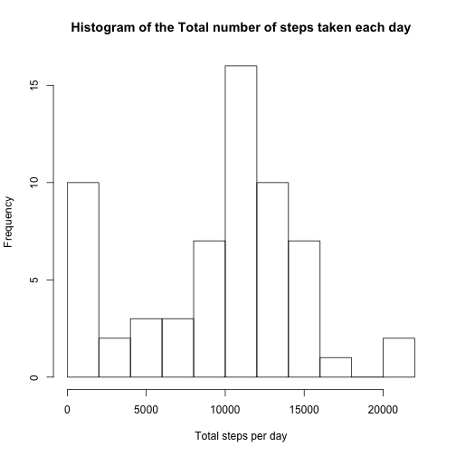

## Loading and preprocessing the data

Unzip the file and load it in R


```r
unzip ("activity.zip",exdir = ".")
dateDownloaded <- date()
activity <- read.csv("activity.csv", stringsAsFactors = FALSE)
```

## What is mean total number of steps taken per day?

Group the dataset by date and summarise by summing the the number of steps.
The histogram shows the distribution of total number of steps taken per day.
The mean and median of the total number of steps taken per day is reported.


```r
library(dplyr)
by_date <- group_by(activity, date)
steps_perday <- summarise(by_date, sum = sum(steps, na.rm = TRUE))
hist(steps_perday$sum, 10, xlab = "Total steps per day", 
     main = "Histogram of the Total number of steps taken each day")
```

 

```r
sprintf("Mean of the total number of steps taken per day = %f ",mean(steps_perday$sum))
```

```
## [1] "Mean of the total number of steps taken per day = 9354.229508 "
```

```r
sprintf("Median of the total number of steps taken per day = %f ", median(steps_perday$sum))
```

```
## [1] "Median of the total number of steps taken per day = 10395.000000 "
```

## What is the average daily activity pattern?
The plot shows the average daily activity pattern, the number of steps for each interval, averaged across each day.
The interval witht the maximum average numebr of steps is calculated.


```r
by_int <- group_by(activity, interval)
av_perint <- summarise(by_int, mean = mean(steps, na.rm = TRUE))
with(av_perint, plot(interval, mean, type = "l", 
                     ylab = "Average steps per interval", 
                     main = "Average number of steps taken for each interval"))
```

 

```r
max_int <- av_perint[match(max(av_perint$mean), av_perint$mean),]$interval
sprintf("Interval with the maximum avaerage number of steps = %f", max_int)
```

```
## [1] "Interval with the maximum avaerage number of steps = 835.000000"
```

## Imputing missing values

The missing value of number of steps may affect the analysis. The strategy to fill the missing values is to use the mean of the corresponding 5min interval.


```r
sprintf("Total number of missing values in the dataset = %d", sum(is.na(activity$steps)))
```

```
## [1] "Total number of missing values in the dataset = 2304"
```

```r
acti_nona <- activity
acti_nona[is.na(acti_nona$steps),]$steps <- 
        av_perint[match(acti_nona[is.na(acti_nona$steps),]$interval,av_perint$interval),]$mean

by_date2 <- group_by(acti_nona, date)
steps_perday2 <- summarise(by_date2, sum = sum(steps, na.rm = TRUE))

hist(steps_perday2$sum, 10, xlab = "Total steps per day - no missing values", 
     main = "Histogram of the Total number of steps taken each day")
```

 

```r
sprintf("Mean of the total number of steps taken per day = %f ",mean(steps_perday2$sum))
```

```
## [1] "Mean of the total number of steps taken per day = 10766.188679 "
```

```r
sprintf("Median of the total number of steps taken per day = %f ", median(steps_perday2$sum))
```

```
## [1] "Median of the total number of steps taken per day = 10766.188679 "
```

The histogram without the missing values is different, the number of days with few steps (near 0) is smaller. As a consequence the mean total steps per day is higher and is equal to the median.

## Are there differences in activity patterns between weekdays and weekends?


```r
acti_nona$day <- weekdays(strptime(acti_nona$date, format = "%Y-%m-%d"))
acti_nona$day_type <- NA
acti_nona[acti_nona$day %in% c("Saturday", "Sunday"),]$day_type <- "weekend"
acti_nona[!acti_nona$day %in% c("Saturday", "Sunday"),]$day_type <- "weekday"
acti_nona$day_type <- factor(acti_nona$day_type)

by_int_day <- group_by(acti_nona, interval, day_type)
av_perintday <- summarise(by_int_day, mean = mean(steps, na.rm = TRUE))

library(lattice)
xyplot(mean ~ interval | day_type, data = av_perintday, type = "l",layout = c(1, 2))
```

 

We can see differences between the activity pattern in weekdays and weekend. For example, there is a steep increase in the average number of steps at interval 500 in weekdays, but not in weekend.


